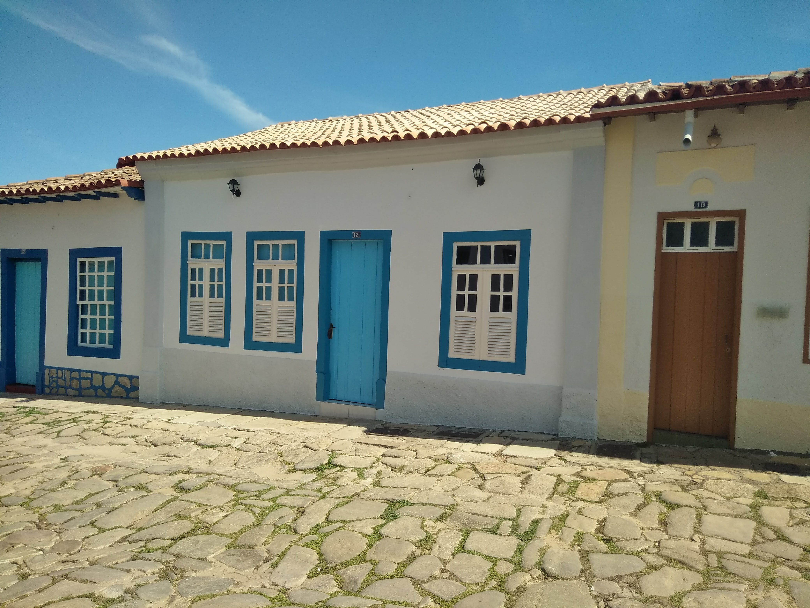
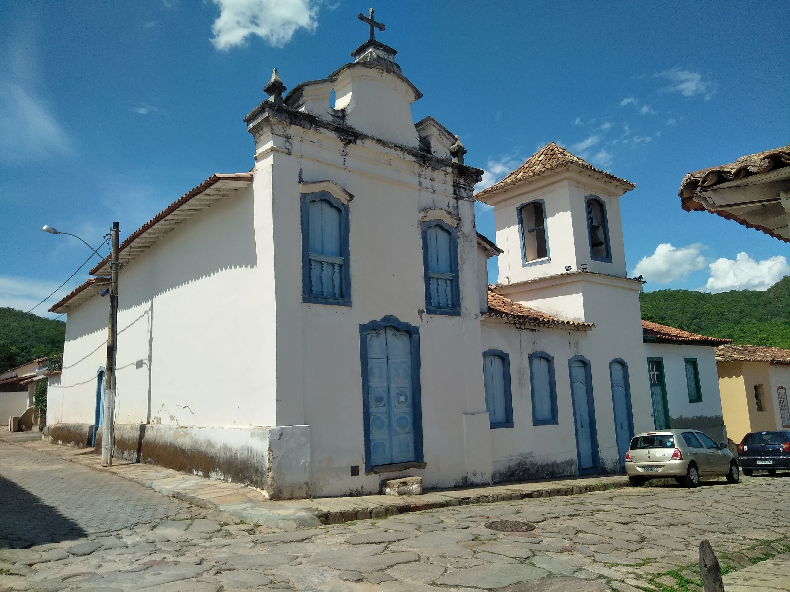
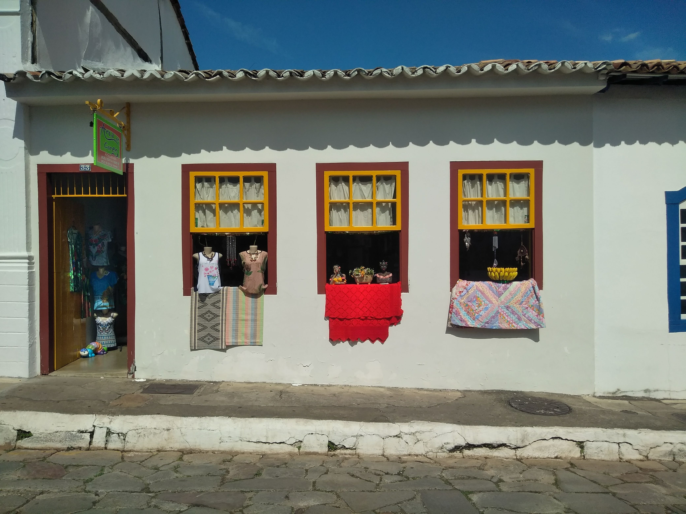
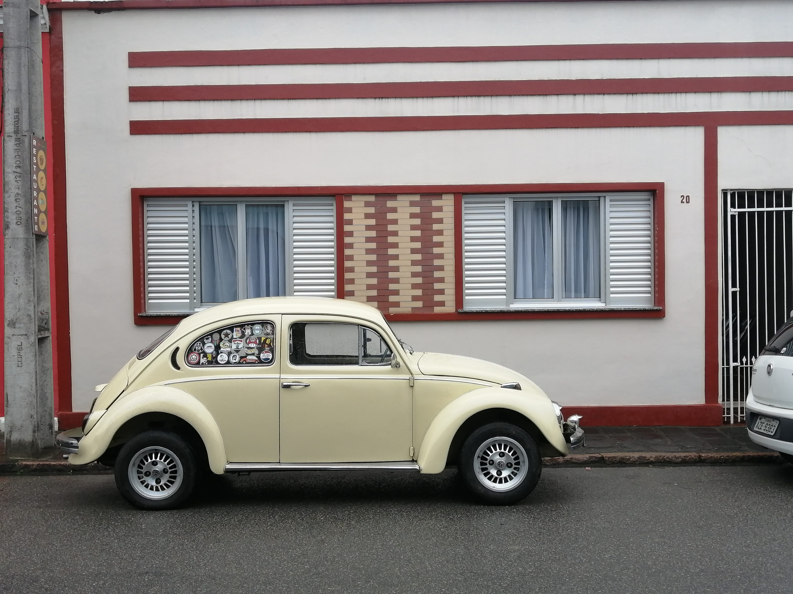

I went to Brazil for the first time in October 2018. Differently from the usual touristic routes (Rio de Janeiro and São Paulo), I went to visit Brasilia and Goias. The former is the capital of Brazil located in the district of Brasilia and the latter is an importan state located in the center of the nation. From the beginning, I had the privilege to enjoy the richness and variety of this country in terms of nature and society. If you are interested in the dimension of Brazil compared to Europe, you can have a look at a Peters World Map.

Below you can see some of the images I took in the city of Goiás (also known as Góias Velho) which is a brazilian municipality classified as UNESCO World Heritage and ancient capital of the homonym state. 

<div style="text-align: center">


<p style="text-align:center;"> A typical house.</p>
</div>

<div style="text-align: center">


<p style="text-align:center;">A church.</p>
</div>

<div style="text-align: center">


<p style="text-align:center;">A clothes shop</p>
</div>

The city is also famous to be the place of birth of the most well-known brazilian poetess named Cora Coralina. One of his famous poetry **Assim eu vejo a vida**:


                           A vida tem duas faces:
                           Positiva e negativa
                           O passado foi duro
                           mas deixou o seu legado
                           Saber viver é a grande sabedoria
                           Que eu possa dignificar
                           Minha condição de mulher,
                           Aceitar suas limitações
                           E me fazer pedra de segurança
                           dos valores que vão desmoronando.
                           Nasci em tempos rudes
                           Aceitei contradições
                           lutas e pedras
                           como lições de vida
                           e delas me sirvo
                           Aprendi a viver.
                           
                           
For my second trip in Brazil, I went to the south in the state of Paranà (the one with the highest Human Development Index). The beautiful image below is a Volkswagen Beetle which we can still see in the street of Morretes, which is a small historic city of the Brazilian state of Paraná.                           

<div style="text-align: center">



</div>

For a complete reflection of my trip in Brazil, currently in italian, you can have a look at the file below. 

<div class="contributor_org">
`r xfun::embed_file(here::here("brazil", "Riflessione_sul_Brasile.pdf"), text = "Download pdf here")`
</div>

```{r eval=FALSE, include=FALSE, layout="l-body-outset"}
library(rmarkdown)
paged_table(mtcars)
```


