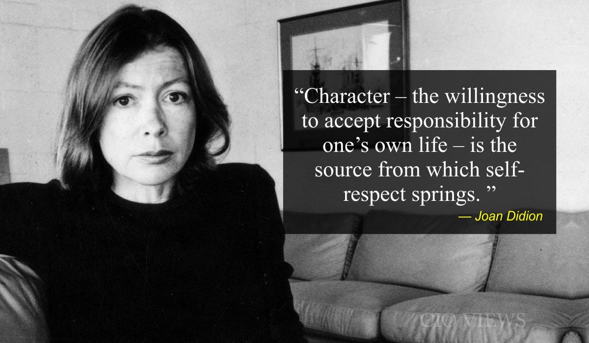

Once, in a dry season, I wrote in large letters across two pages of a notebook that innocence ends when one is stripped of the delusion that one likes oneself. Although now, some years later, I marvel that a mind on the outs with itself should have nonetheless made painstaking record of its every tremor, I recall with embarrassing clarity the flavor of those particular ashes. It was a matter of misplaced self-respect.

I had not been elected to Phi Beta Kappa. This failure could scarcely have been more predictable or less ambiguous (I simply did not have the grades), but I was unnerved by it; I had somehow thought myself a kind of academic Raskolnikov, curiously exempt from the cause-effect relationships that hampered others. Although the situation must have had even then the approximate tragic stature of Scott Fitzgerald's failure to become president of the Princeton Triangle Club, the day that I did not make Phi Beta Kappa nevertheless marked the end of something, and innocence may well be the word for it. I lost the conviction that lights would always turn green for me, the pleasant certainty that those rather passive virtues which had won me approval as a child automatically guaranteed me not only Phi Beta Kappa keys but happiness, honour, and the love of a good man (preferably a cross between Humphrey Bogart in Casablanca and one of the Murchisons in a proxy fight); lost a certain touching faith in the totem power of good manners, clean hair, and proven competence on the Stanford-Binet scale. To such doubtful amulets had my self-respect been pinned, and I faced myself that day with the nonplussed wonder of someone who has come across a vampire and found no garlands of garlic at hand.

Source: https://www.vogue.com/article/joan-didion-self-respect-essay-1961

 Character, Joan Didion.

